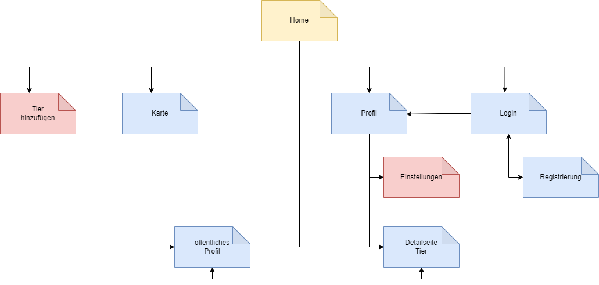

# AdoptAPal

Eine Android App für Mobile Computing 1. Entwickelt von Molham Al-khodari, Martin Kühlborn und Anna-Lisa Merkel.

## Was ist AdoptAPal?

AdoptAPal ist eine Applikation, die dabei helfen soll, Tiere in der Nähe zu finden, die zur Adoption angeboten werden, und deren Anbieter zu kontaktieren. Dabei sollen sowohl die Anbieter (Privatpersonen, Züchter, Tierheime) als auch die Interessenten die App nutzen können. Eine Registrierung ist nur notwendig, wenn man als Anbieter Tiere hochladen möchte. Der Großteil der Funktionalitäten ist auch ohne Registrierung erreichbar.

## Kernfunktionalitäten
- Listenansicht mit allen hochgeladenen Tieren
- Detailansicht aller Tiere
- Detailansicht aller Anbieter (separates öffentliches und privates Profil)
- Filterung der Listenansicht / Suchfunktion
- Kartenansicht mit Standorten der Anbieter
- Formular zum Hochladen neuer Tiere
- Speichern einzelner Tiere für später und dazugehörige Merkliste
- Registrierung und Anmeldung
- Möglichkeit zum Ändern eigener Daten

## Installationsanleitung
In der AndroidManifest.xml (Zeile 36) muss zur Verwendung von Google Maps ein entsprechender API-Key eingetragen werden.

```
<meta-data
    android:name="com.google.android.geo.API_KEY"
    android:value="[API-KEY]" />
```

## Testnutzer
| Name | Email-Adresse |
| --- | --- |
| Hans Meyer | hans.meyer@fakemail.io |
| Gabi Schnitzler | gabi.schnitzler@tierheim.de |
| Richard Klöse | richard.kloese@mail.de |
| Tierheim Katzentempel | katzentempel@tierheim.de |
| Felix Richter | felix.richter@email.com |

Die Passwörter der Testnutzer sind unwichtig, sodass jedes beliebige funktioniert. Überprüft wird nur, ob überhaupt ein Passwort eingegeben wurde (siehe Abschnitt "bekannte Bugs / Verbesserungsmöglichkeiten").
## Aufbau


**Home:** Startseite der App mit einer Liste aller hochgeladenen Tiere

**Tier hinzufügen:** Formular zum Hochladen eines neuen Tieres, nur nach Anmeldung verfügbar

**Karte:** Kartenansicht, die die Standorte aller Anbieter zeigt und per Klick auf einen Marker zum Profil des Anbieters navigiert

**Profil:** zeigt gemerkte Tiere und (nach Anmeldung) hochgeladene Tiere, nur für den entsprechenden Nutzer sichtbar

**Login:** Formular zum Anmelden in der App

**Registrierung:** Formular zum Registrieren in der App

**Einstellungen:** Formular zum Ändern der eigenen Nutzerdaten, nur nach Anmeldung verfügbar

**Detailseite Tier:** detaillierte Informationen zu jedem Tier und Angabe des Anbieters

**Öffentliches Profil:** zeigt Kontaktinformationen und hochgeladene Tiere des jeweiligen Nutzers, für alle Nutzer sichtbar

Über die Bottom-Bar-Navigation erreicht werden, können die Seiten "Karte", "Home" und "Profil" jederzeit. Bis auf die Seiten "Tier hinzufügen" und "Einstellungen" können alle Seiten auch ohne Anmeldung erreicht werden.

## Datenbank


## bekannte Bugs / Verbesserungsmöglichkeiten
**Erweiterung um eine Bewertungsfunktion**
- Nutzer können die Möglichkeit erhalten, einen Anbieter mit einem bis fünf Sternen zu bewerten
- die Bewertung wird auf dem öffentlichen Profil des Anbieters vorgenommen und kann dort auch eingesehen werden
- diese Funktion war zu Beginn geplant, musste aus Zeitgründen allerdings verworfen werden

**Erweiterung um ein Schwarzes Brett**
- auf dieser Seite könnten Nutzer beiträge erstellen wie "Ich suche einen schwarzen Labrador, wird in in meiner Nähe einer angeboten?" oder "Ich habe eine Gruppe junger Kaninchen abzugeben"
- Nutzer können auf diese Gesuche reagieren und mit den Erstellern in Kontakt treten
- auch diese Funktion war zu Beginn geplant, fiel aber der Zeit zum Opfer

**Erweiterung um eine Datenbanktabelle für gemerkte Tiere**
- gemerkte Tiere werden aktuell anhand eines bool Wertes in der Animal-Tabelle gespeichert
- dadurch haben alle Nutzer, die die App nutzen, dieselben Tiere in ihrer Merkliste stehen
- die Erweiterung der Datenbank um eine spezifische Tabelle könnte dieses Problem lösen (gemerkte Tiere werden je angemeldetem Nutzer gespeichert)

**Prüfung des Passwortes**
- Passwörter werden aktuell nicht in der Datenbank gespeichert
- wenn ein Nutzer sich einloggt, wird lediglich geprüft ob ein Passwort eingegeben wurde, jedoch nicht, ob es auch zu der Email-Adresse passt, die bei der Registrierung angegeben wurde
- in Zukunft werden Passwörter im separaten Backend gespeicht, wie auch der Rest der Nutzerdaten

**Entfernung zwischen Nutzer und Tier**
- gibt ein Nutzer eine Adresse an, wird ihm in der Listenansicht der Tiere die Entfernung zwischen ihm und dem Standort des Tieres angezeigt
- um eine Adresse anzugeben, muss ein Nutzer aber in der App registrieren
- besser wäre es, den aktuellen Standort des Nutzers zur Berechnung der Entfernung zu verwenden
- dies konnte allerdings nicht umgesetzt werden

**CICD Testpipeline**
- die Testpipeline funktionierte zuvor
- da das Testlab nun aber offline ist, läuft es natürlich nicht mehr

## genutzte Tools und andere Quellen
- Android Studio (IDE)
- Gitlab (Versionsverwaltung)
- drawio (Diagramme)
- Figma (Mockups)
- Retrofit (Netzwerkzugriffe)
- Google Maps API (Kartenansicht)
- [Positionstack](https://positionstack.com/) (API zur Umwandlung von Adressen in Koordinaten)
- default Bilder ([Andres Llanezas](https://mrandrelo.myportfolio.com/profiles-project-animal-default-profile-pictures))


## App features

- Address to LatLong conversion with positionstack-Api
- MapsScreen with clickable markers for each user to navigate to user screen
- login simulation with
